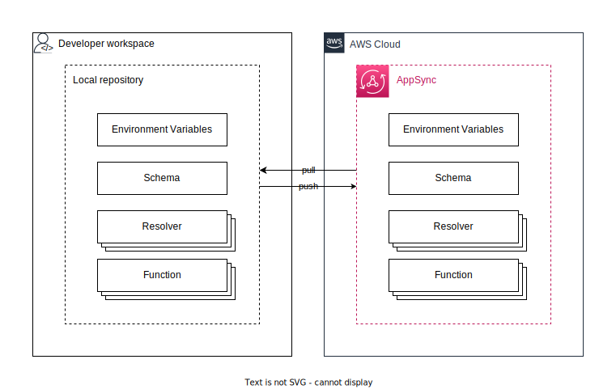

# Concept guide

## Why syncup?

AWS AppSync makes it easy to build GraphQL APIs through the management console.
However, API version-control is not straightforward in this scenario.

The syncup provides API snapshot capture and restoration features, helping with version management.



## Compatibility with AWS AppSync

The syncup is compatible with AWS AppSync in most cases.
However, the only exception is with the identifier for AppSync Function:
in contrast to AWS AppSync, which uses the Function ID as an identifier, syncup uses the Function Name as an identifier.
This makes it easier to migrate to another AppSync GraphQL API.

## Data format

Directory structure:

```text
<base-dir>
├── schema.graphqls
├── resolvers
│   └── <resolver-type-name>
│       └── <resolver-field-name>
│           ├── metadata.json
│           ├── request.vtl  # only if VTL runtime
│           ├── response.vtl # only if VTL runtime
│           └── code.js      # only if JavaScript runtime
└── functions
    └── <function-name>
        ├── metadata.json
        ├── request.vtl  # only if VTL runtime
        ├── response.vtl # only if VTL runtime
        └── code.js      # only if JavaScript runtime
```

### Schema format

| Required    | File path         | Description                                                                                           |
| ----------- | ----------------- | ----------------------------------------------------------------------------------------------------- |
| any runtime | `schema.graphqls` | Adhering to the GraphQL [SDL (Schema Definition Language)](https://graphql.org/learn/schema/) format. |

### Resolver format

The requestMappingTemplate field in the AppSync Resolver model format.

| Required           | File path                                      | Description                                                                                                                                                                                                                                                                                                                                                          |
| ------------------ | ---------------------------------------------- | -------------------------------------------------------------------------------------------------------------------------------------------------------------------------------------------------------------------------------------------------------------------------------------------------------------------------------------------------------------------- |
| any runtime        | `resolvers/<resolver-type-name>/metadata.json` | Excluding `resolverArn`, `requestMappingTemplate`, `responseMappingTemplate`, and `code` fields from the AppSync [Resolver](https://github.com/aws/aws-sdk-go-v2/blob/a894e2744856c667b35ae096c1a6a48e71f7c8c0/codegen/sdk-codegen/aws-models/appsync.json#L6664-L6747) format. Additionally, the `pipelineConfig` field has `functionNames` instead of `functions`. |
| VTL runtime        | `resolvers/<resolver-type-name>/request.vtl`   | `requestMappingTemplate` field in the AppSync [Resolver](https://github.com/aws/aws-sdk-go-v2/blob/a894e2744856c667b35ae096c1a6a48e71f7c8c0/codegen/sdk-codegen/aws-models/appsync.json#L6664-L6747) format.                                                                                                                                                         |
| VTL runtime        | `resolvers/<resolver-type-name>/response.vtl`  | `responseMappingTemplate` field in the AppSync [Resolver](https://github.com/aws/aws-sdk-go-v2/blob/a894e2744856c667b35ae096c1a6a48e71f7c8c0/codegen/sdk-codegen/aws-models/appsync.json#L6664-L6747) format.                                                                                                                                                        |
| JavaScript runtime | `resolvers/<resolver-type-name>/code.js`       | `code` field in the AppSync [Resolver](https://github.com/aws/aws-sdk-go-v2/blob/a894e2744856c667b35ae096c1a6a48e71f7c8c0/codegen/sdk-codegen/aws-models/appsync.json#L6664-L6747) format.                                                                                                                                                                           |

### Function format

| Required           | File path                                 | Description                                                                                                                                                                                                                                                                                                                                        |
| ------------------ | ----------------------------------------- | -------------------------------------------------------------------------------------------------------------------------------------------------------------------------------------------------------------------------------------------------------------------------------------------------------------------------------------------------- |
| any runtime        | `functions/<function-name>/metadata.json` | Excluding `functionId` (as functions are identified by `name`), `functionArn`, `requestMappingTemplate`, `responseMappingTemplate`, and `code` fields from the AppSync [FunctionConfiguration](https://github.com/aws/aws-sdk-go-v2/blob/a894e2744856c667b35ae096c1a6a48e71f7c8c0/codegen/sdk-codegen/aws-models/appsync.json#L4322-L4396) format. |
| VTL runtime        | `functions/<function-name>/request.vtl`   | `requestMappingTemplate` field in the AppSync [FunctionConfiguration](https://github.com/aws/aws-sdk-go-v2/blob/a894e2744856c667b35ae096c1a6a48e71f7c8c0/codegen/sdk-codegen/aws-models/appsync.json#L4322-L4396) format.                                                                                                                          |
| VTL runtime        | `functions/<function-name>/response.vtl`  | `responseMappingTemplate` field in the AppSync [FunctionConfiguration](https://github.com/aws/aws-sdk-go-v2/blob/a894e2744856c667b35ae096c1a6a48e71f7c8c0/codegen/sdk-codegen/aws-models/appsync.json#L4322-L4396) format.                                                                                                                         |
| JavaScript runtime | `functions/<function-name>/code.js`       | `code` field in the AppSync [FunctionConfiguration](https://github.com/aws/aws-sdk-go-v2/blob/a894e2744856c667b35ae096c1a6a48e71f7c8c0/codegen/sdk-codegen/aws-models/appsync.json#L4322-L4396) format.                                                                                                                                            |

## See also

- [How-to guide](./how-to-guide.md)
